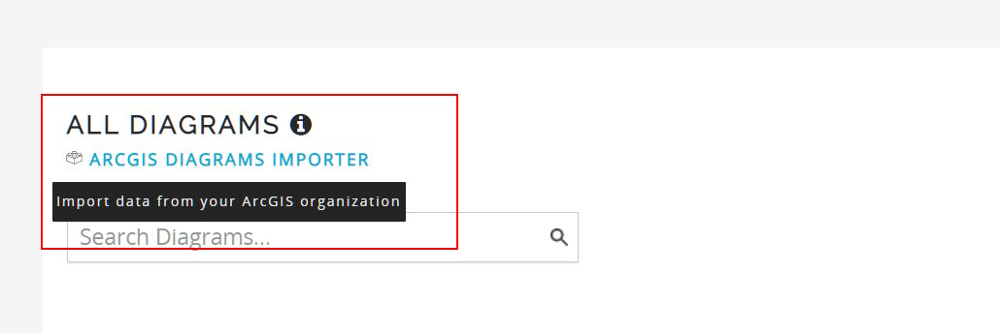
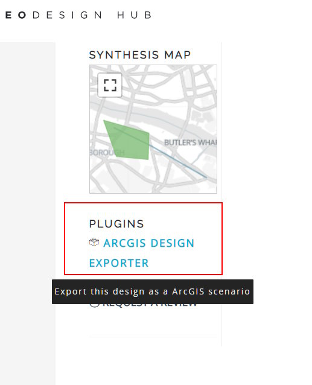

# ESRI <-> Geodesignhub Bridge

App using ArcGIS API for JavaScript to connect to discover and migrate GeoPlanner specific content.

### APIs Used

 - [ArcGIS API for Javascript](https://developers.arcgis.com/javascript/latest/api-reference/)
 - [ArcGIS Rest API - Content Management](https://developers.arcgis.com/rest/users-groups-and-items/working-with-users-groups-and-items.htm)
 - [Geodesignhub](https://www.geodesignhub.com/)
 - [Geodesignhub API](https://www.geodesignhub.com/api/)

### The Process

This app is used as a Geodesignhub plugin and can be added to your project via the Geodesignhub plugins panel. The import diagrams from Geoplanner feature is currently setup as a "administrator only" privileges and the export feature is available to every member of a Geodesighub project. 

### Pre-requisites
As a pre-requisite to using this plugin, you must create a project with ESRI connections that must be linked , you can mention this to your Geodesignhub project administrator. 

### Screenshots

### Import data from Geoplanner
Available for Project Administrators

### Export to Geoplanner / ArcGIS
Available to everyone

## Adding the plugin

The plugin can be added to a project through the project administration panels in Geodesignhub.

#### For questions about the demo web application:
> John Grayson | Prototype Specialist | Geo Experience Center\
> Esri | 380 New York St | Redlands, CA 92373 | USA\
> T 909 793 2853 x1609 | [jgrayson@esri.com](mailto:jgrayson@esri.com) | [GeoXC Demos](https://GeoXC.esri.com) | [esri.com](https://www.esri.com)
